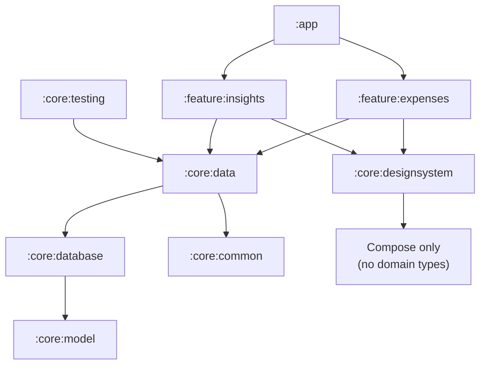

# SpendLens

[](https://github.com/Anmolzezx/SpendLens/actions/workflows/build.yml)

An offline-first expense tracker for Android. Every action works with the network off, because the
local database is the source of truth rather than a cache in front of one.

Built as a portfolio project — the goal is demonstrating architecture, testing and build engineering,
not feature count.

> **Status: in progress.** The app is fully usable offline today — add, edit, browse and delete
> expenses, all persisted in Room. Receipt OCR and remote sync are not built yet. See
> [Roadmap](#roadmap) for exactly what exists.

---

## What works today

- **Add, edit and delete expenses**, persisted in Room and surviving app restarts
- **Currency-correct money handling** — amounts stored as `Long` minor units, formatted from the
  currency's own precision (2 places for USD, **0 for JPY**, 3 for KWD)
- **Monthly insights** — total spend and a per-category breakdown, with a hand-drawn `Canvas`
  proportion bar
- **Soft deletes** — deletions become tombstones so they can eventually sync, rather than vanishing
- **Material 3 design system** — light/dark, optional dynamic colour, semantic colours for budget
  and sync state
- **Type-safe navigation** — `@Serializable` routes, no string templates
- **Every UI state built** — loading, empty, empty-because-filtered, error, success

---

## Architecture

Nine Gradle modules. Features depend on `core`, never on each other.



**`:core:model` depends on nothing** — pure Kotlin, no Android imports, so domain logic is testable
on the JVM in milliseconds.

**`:core:designsystem` knows nothing about the domain.** `StatusBadge` takes a `Tone`, not a
`SyncState`; feature modules do the mapping. That keeps the design system renderable without any
business logic attached.

**Features never import features.** `feature:expenses` cannot reference `feature:capture` — it
exposes an `onNavigateToCapture: () -> Unit` lambda, and `:app`, the only module that sees both,
resolves it. Every feature module compiles and tests on its own.

### The UI layer

Each screen is split in two:

| | Visibility | Role |
|---|---|---|
| `…Screen` | public | owns the ViewModel, collects state |
| `…Content` | internal | pure — takes state, emits lambdas |

`…Content` is what previews, screenshot tests and Compose UI tests render. The whole UI was built
against static fixtures first; wiring the real data layer later changed only the `…Screen` bodies.

---

## Tech stack

| Concern | Choice |
|---|---|
| UI | Jetpack Compose, Material 3 |
| Navigation | Navigation Compose 2.10, type-safe `@Serializable` routes |
| DI | Hilt 2.60 via **KSP** |
| Database | Room 2.8, schema exported and committed |
| Async | Coroutines, `Flow`, `StateFlow` |
| Build | Gradle Kotlin DSL, version catalog, **7 convention plugins** |
| Static analysis | ktlint (`ktlint_official`) + detekt, both enforced in CI |
| Testing | JUnit, Robolectric, Turbine, kotlinx-coroutines-test |

Kotlin 2.2.10 · AGP 9.3.2 · minSdk 26 · target/compileSdk 37 · JDK 17 bytecode

### Build engineering

Module build files are 3–12 lines because the shared configuration lives in typed, composable
convention plugins rather than a `subprojects { }` block:

```kotlin
// feature/expenses/build.gradle.kts — the whole file
plugins { id("spendlens.android.feature") }
android { namespace = "com.spendlens.feature.expenses" }
```

`spendlens.android.feature` applies `…library.compose`, which applies `…library` — so the
compileSdk/minSdk/Java-target decision exists in exactly one place.

---

## Testing

**74 tests, all on the JVM**, all running on every push.

| Module | Tests | What they cover |
|---|---|---|
| `:core:model` | 47 | money formatting and parsing, budget thresholds, monthly aggregation, fixture invariants |
| `:core:database` | 13 | DAO queries, type converters, soft deletes, category seeding |
| `:core:data` | 7 | repository against a real in-memory database |
| `:feature:expenses` | 7 | list ViewModel via Turbine |

Two deliberate choices:

**DAO tests run on Robolectric, not an emulator.** A DAO test that only runs on a device is a DAO
test that doesn't run — query correctness is exactly what should be caught on every push.

**`Clock`, `ZoneId` and `Locale` are injected**, never read statically. That's what lets a ViewModel
test assert `"$42.87"` exactly, with no Android framework involved.

The tests are checked for teeth, not just green: breaking `Currency.getDefaultFractionDigits()` fails
precisely the two currency tests that guard it, and nothing else.

---

## Running it

```bash
git clone https://github.com/Anmolzezx/SpendLens.git
cd SpendLens
./gradlew assembleDebug
```

Requires JDK 25 (Gradle's daemon toolchain; see `gradle/gradle-daemon-jvm.properties`). The build
targets JDK 17 bytecode.

```bash
./gradlew test                    # all unit tests
./gradlew ktlintCheck detekt      # static analysis
./gradlew build                   # everything
```

---

## Roadmap

| Phase | Scope | Status |
|---|---|---|
| 0 | Build tooling, modules, CI, lint | ✅ done |
| 1 | Domain model, Room, repositories, expense CRUD | ✅ done |
| 2 | CameraX capture + ML Kit receipt OCR | ⬜ not started |
| 3 | Retrofit, WorkManager sync, conflict resolution, Paging 3 | ⬜ not started |
| 4 | Budgets, biometric lock, animation polish | 🟡 partial — insights and charts built, budgets not persisted |
| 5 | Baseline Profiles, Macrobenchmark, Paparazzi, accessibility pass | ⬜ not started |
| 6 | Release build, Play internal testing | ⬜ not started |

Two design questions are open and recorded in [DECISIONS.md](DECISIONS.md): whether
`Expense.occurredAt` should be a `LocalDate` rather than an `Instant`, and whether
`SyncState.CONFLICT` survives a last-write-wins strategy that can never produce it.

---

## Documentation

| Document | Contents |
|---|---|
| [DECISIONS.md](DECISIONS.md) | Why the codebase is the way it is — 17 decisions, each with its alternative and cost |
| [PROGRESS.md](PROGRESS.md) | Phase-by-phase tracker |
| [spendlens-project-plan.md](spendlens-project-plan.md) | The original specification |
| [docs/](docs/) | Session notes |

---

## License

Not currently licensed for reuse.
